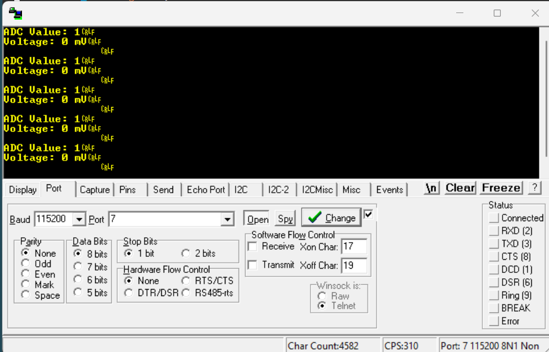
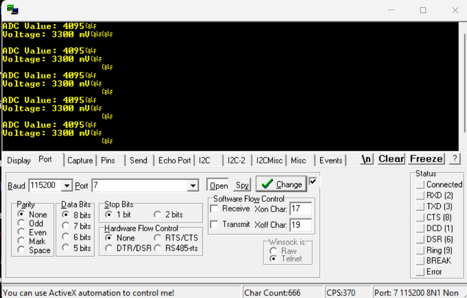

# STM32 Bare-Metal ADC Voltage Monitor

A bare-metal STM32 project that reads an analog input using the ADC peripheral and transmits the measured value over UART. The project is implemented entirely using CMSIS register definitions without relying on the STM32 HAL library.

---

## Features

- Register-level peripheral programming
- Modular UART driver
- Modular ADC driver
- Modular SysTick driver
- Polling-based ADC conversion
- Integer-based voltage calculation (mV)
- Reusable driver architecture

---

## Hardware

- STM32 NUCLEO-F446RE

---

## Project Structure

```
Project
│
├── Inc
│   ├── adc_driver.h
│   ├── uart_driver.h
│   └── systick_driver.h
│
├── Src
│   ├── main.c
│   ├── adc_driver.c
│   ├── uart_driver.c
│   └── systick_driver.c
│
└── Startup
```

---

## Drivers

### UART Driver

**Functions**

```c
UART_Init();
UART_WriteChar();
UART_WriteString();
UART_WriteUInt();
```

**Responsibilities**

- Configure USART2
- Configure GPIO alternate functions
- Transmit characters and strings
- Print unsigned integer values

---

### ADC Driver

**Functions**

```c
ADC_Init();
ADC_Read();
```

**Responsibilities**

- Configure GPIO for analog mode
- Initialize ADC1
- Perform software-triggered conversions
- Poll the End Of Conversion (EOC) flag
- Return the converted digital value

---

### SysTick Driver

**Functions**

```c
SysTick_Init();
SysTick_DelayMs();
```

**Responsibilities**

- Configure the Cortex-M4 SysTick timer
- Generate millisecond delays
- Poll the COUNTFLAG status bit

---

## Voltage Conversion

The ADC operates in 12-bit resolution.

- Resolution: **0 – 4095**
- Reference Voltage: **3.3 V**

The measured voltage is calculated using integer arithmetic:

```c
millivolts = (adcValue * 3300U) / 4095U;
```

Using integer arithmetic avoids floating-point overhead while maintaining good accuracy.

---

## Example Output

```
Voltage Monitor Started

ADC Value: 0
Voltage: 0 mV

ADC Value: 1024
Voltage: 825 mV

ADC Value: 2048
Voltage: 1650 mV

ADC Value: 3072
Voltage: 2475 mV

ADC Value: 4095
Voltage: 3300 mV
```

---
---

## Images

## Images

### Hardware Setup (GND Connection)

<p align="center">
  
</p>

### Serial Output (RealTerm)

<p align="center">
  
</p>

### Hardware Setup (3.3V Connection)

<p align="center">
  
</p>

### Serial Output (RealTerm)

<p align="center">
  
</p>


## Concepts Covered

### UART

- USART initialization
- GPIO Alternate Function configuration
- Baud rate configuration
- Polling-based transmission
- Integer-to-string conversion

### ADC

- Analog GPIO configuration
- ADC initialization
- Channel selection
- Software-triggered conversion
- End Of Conversion (EOC) polling
- Reading conversion results

### SysTick

- Cortex-M4 SysTick timer
- Reload and Current Value registers
- COUNTFLAG polling
- Millisecond delay generation

### Embedded Software Design

- Register-level programming
- CMSIS-based peripheral access
- Driver modularization
- Polling-based peripheral control
- Integer arithmetic in embedded systems

---

## Software Requirements

- STM32CubeIDE
- CMSIS Device Package

**No HAL drivers are used.**

---

## Future Improvements

- Multi-channel ADC support
- Configurable ADC channel selection
- Interrupt-driven ADC conversions
- DMA support
- Continuous conversion mode
- Timer-triggered sampling

---

## Learning Outcome

This project demonstrates how to build reusable peripheral drivers using CMSIS register definitions while understanding the underlying STM32 hardware at the register level.

**Drivers implemented:**

- UART Driver
- ADC Driver
- SysTick Driver

These drivers provide a solid foundation for implementing more advanced peripherals such as Timers, EXTI, SPI, I²C, PWM, DMA, and Interrupts.